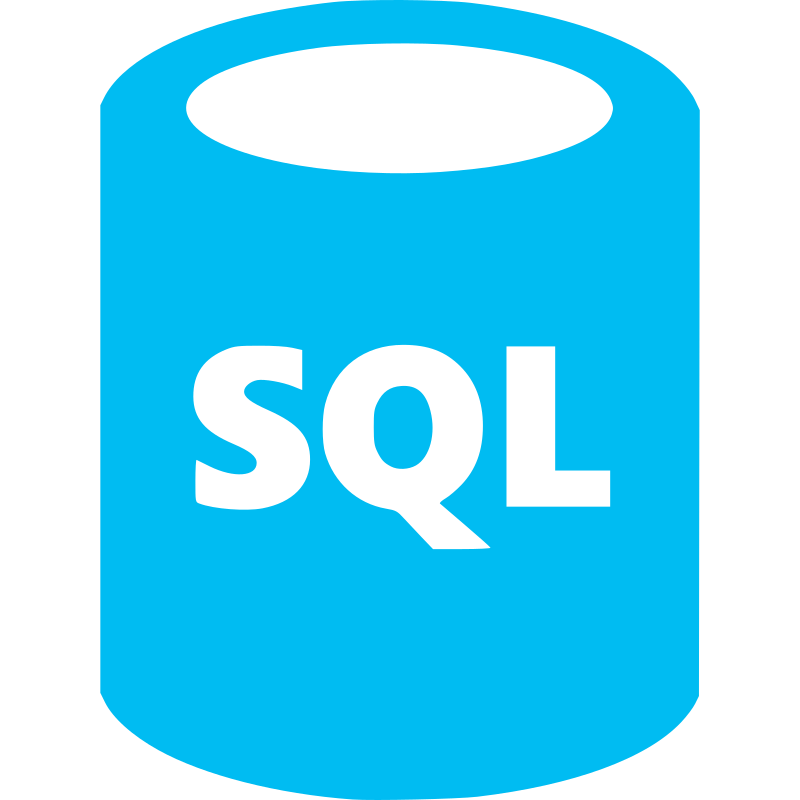
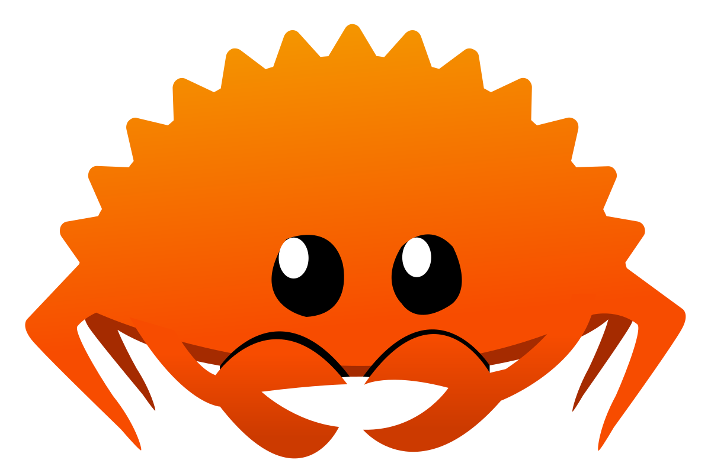

## Hi, there? 👋
I'm Michal Matúš passioned Developer & Coffee lover - I enyoy building complex applications with scalability in mind while enyoying wonderful taste of espresso.

  

## Get in touch

  
    

  

### Languages/Frameworks I'm good at:

### Things I like to use to store data:

### Things I'm learning:

